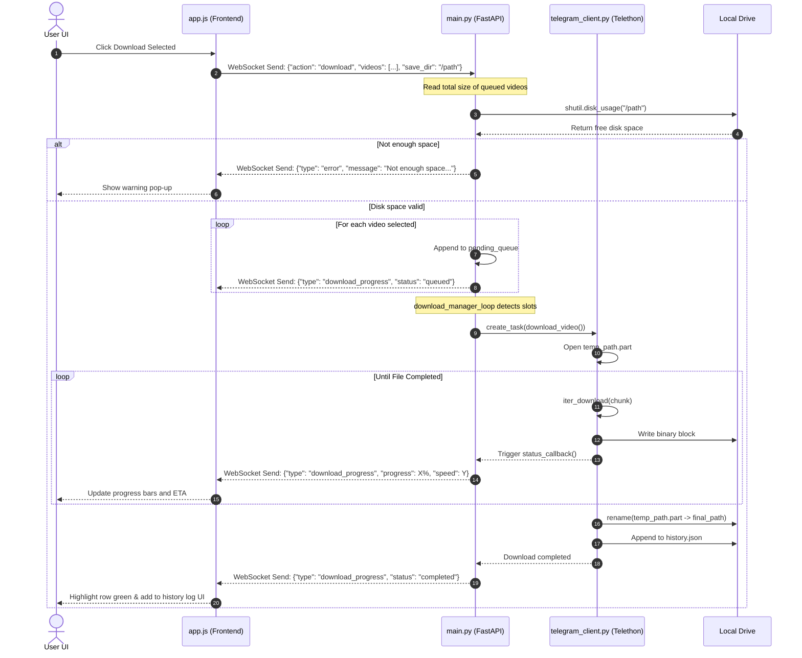

# 🚀 TeleForge: Telegram Bulk Video Downloader


A local web application that runs on your computer to connect securely to your Telegram account, scan chats for videos, and download files in bulk with advanced queue controls and network resilience

---

## Table of contents

1. [Project overview](#project-overview)
2. [Live demo & visuals](#live-demo--visuals)
3. [Tech stack & choices](#tech-stack--choices)
4. [Core features](#core-features)
5. [Architecture & project structure](#architecture--project-structure)
6. [State management & data flow](#state-management--data-flow)
7. [API reference](#api-reference)
8. [Local installation & setup](#local-installation--setup)
9. [Configuration & customization](#configuration--customization)
10. [Known limitations & troubleshooting](#known-limitations--troubleshooting)
11. [Security & privacy notes](#security--privacy-notes)
12. [Future roadmap](#future-roadmap)
13. [Contributing](#contributing)
14. [License](#license)

---

## Project overview

TeleForge is a local web application designed to help users archive their personal Telegram media. It provides a browser-based user interface to interact with the MTProto Telegram API safely from a local computer. By running locally, it ensures that your session data, credentials, and downloaded video files never leave your system.

Many users face difficulties when trying to save large volumes of video files from Telegram channels or groups because the official clients do not support structured bulk downloads, resume states, or global speed limits. TeleForge addresses these limitations by providing a dedicated multi-threaded download manager that automates the extraction and storage process while preventing local disk overflow.

> ***TeleForge gives users complete control over archiving their personal Telegram chat history locally without relying on cloud services or sharing sensitive session credentials with third parties.***

---

## Live demo & visuals

This project is a local web application and is not hosted online to protect user privacy. All authentication and video transfers occur directly between your computer and Telegram's servers.

### Interface preview

```text
+-------------------------------------------------------------------------+
|  TeleForge  |  Group: Archival Channel (12,450 members)                 |
| ----------- | --------------------------------------------------------- |
|  [🔌 Connect] |  [x] Video_2026_01.mp4  (450 MB)  [Downloading: 45%]     |
|  [📂 Browser] |  [ ] Demo_Presentation.mp4 (1.2 GB) [Queued]             |
|  [⚙️ Settings]|  [x] Tutorial_Guide.mp4    (85 MB)  [Completed]          |
|  [📜 History] |                                                         |
|             |  [================== Total Progress: 54% ================] |
| ----------- | --------------------------------------------------------- |
| Logs: [07:11:05] Download manager loop started.                         |
+-------------------------------------------------------------------------+
```

*Note: Developers running the project can view the graphical layout by opening `frontend/index.html` after launching the FastAPI backend.*

---

## Tech stack & choices

| Technology | Version | Category | Why Chosen |
| :--- | :--- | :--- | :--- |
| **Python** | 3.11 | Core | Provides natively asynchronous event loop handling and extensive ecosystem for network scraping and file streaming. |
| **FastAPI** | 0.100.0 | Core | Offers extremely low overhead, native support for asynchronous route handlers, and automatic validation using Pydantic models. |
| **Telethon** | 1.30.0 | Core | An official MTProto library that communicates directly with Telegram's binary network protocol, bypassing constraints of standard HTTP bot APIs. |
| **WebSockets** | Latest | Real-time | Facilitates low-latency, bi-directional communication between the background download threads and the browser front-end UI. |
| **Uvicorn** | 0.22.0 | Dev Tools | High-performance ASGI server designed to maximize concurrency throughput for asynchronous Python applications. |
| **Cryptography** | 40.0.0 | Security | Underpins Telethon's protocol layer, securing session keys and locally stored state using hardware-accelerated cryptosystems. |
| **Aiofiles** | 23.1.0 | Storage & APIs | Provides non-blocking file writing system calls to prevent disk operations from freezing the FastAPI request-response threads. |
| **Vanilla JS** | ES6 | Core | Eliminates build compilation steps, enabling the application to run immediately upon cloning without complex node package managers. |
| **Vanilla CSS** | CSS3 | Styling | Utilizes hardware-accelerated transitions and native CSS custom properties for a responsive glassmorphic UI structure. |

---

## Core features

### Real-time video scanner ⭐
- **What it does:** Scans any target channel or group history sequentially using non-blocking API calls and streams metadata back to the interface instantly.
- **User experience:** Users paste a group username or select one from the interactive sidebar, and watch the video list populate in real-time with thumbnails, filenames, durations, and original message captions.

### Resilient network auto-retry engine ⭐
- **What it does:** Tracks socket status during binary transfers and attempts to recover from connection loss by using offset range parameters.
- **User experience:** If the Wi-Fi connection drops, the download status changes to a warning state and attempts a reconnection every 3 seconds for up to 5 retries. Once reconnected, it resumes downloading from the exact block where it was disconnected, avoiding starting over from 0%.

### Smart parallel download manager ⭐
- **What it does:** Schedules downloads based on a user-defined queue limit and handles file chunk allocations in parallel threads.
- **User experience:** Users select multiple videos, set their concurrent download limits (1-10 files), and click download. The manager schedules active downloads in parallel, showing live progress bars, transfer speeds (in KB/s), and estimated time of completion (ETA).

### Secure local session manager
- **What it does:** Keeps user authorization records in an encrypted session folder locally using the MTProto mobile client protocol.
- **User experience:** Users log in using their phone number and a one-time verification code (OTP), alongside their 2FA password. The credentials are encrypted locally so subsequent launches do not require re-authentication.

### Storage space pre-flight guard
- **What it does:** Queries the operating system disk space capacity of the target directory path using non-blocking utility checks before initiating network calls.
- **User experience:** If a download queue requires 25 GB of disk space but the selected hard drive only has 10 GB free, the download queue is halted, and a warning notifies the user of the exact shortage.

---

## Architecture & project structure

The project follows a client-server architecture. The backend runs as a local FastAPI web server managing a stateful Telethon client instance and a dedicated worker loop. The frontend is a single-page application (SPA) that connects to the backend via REST endpoints and a persistent WebSocket channel for live updates.

```text
bulkdownload/
│
├── .vscode/
│   └── settings.json         # Configures IDE Python interpreter and import lookup paths
│
├── backend/
│   ├── sessions/             # Secure folder containing local session databases
│   ├── __pycache__/          # Compiled python files (excluded from repository check-ins)
│   ├── history.json          # Persistent download log database
│   ├── main.py               # FastAPI server entry point, HTTP endpoints, and download worker loop
│   ├── telegram_client.py    # 🌟 Core Telethon wrapper client handling downloads, auth, and retries
│   └── requirements.txt      # Python dependencies list
│
├── frontend/
│   ├── index.html            # Main markup file containing the responsive web application structure
│   ├── style.css             # Styling rules, variables, layout, animations and dark mode theme
│   └── app.js                # State machine, WebSocket listener, dialog binders, and download interface handler
│
├── .gitignore                # Filters out cache folders, sessions, and history files from version control
└── README.md                 # Project documentation (this file)
```

---

## State management & data flow

### State management overview
State resides primarily in memory on both sides:
- **Backend state:** Maintained by the `TelegramDownloaderClient` instance inside `backend/telegram_client.py`. It tracks the current Telethon connection, download tasks (`self.download_tasks`), transfer speed limits, and queue states. Persistent events are written to `backend/history.json`.
- **Frontend state:** Maintained inside `frontend/app.js` via local DOM state trackers, connection socket variables, active video cards maps, and UI flags (e.g., scan states, current active folder paths).

### Data flow walkthrough: initiating a bulk download


---

## API reference

### HTTP REST API

#### Get auth status
- **Method:** `GET`
- **Endpoint:** `/api/auth/status`
- **Description:** Returns the connection state of the local Telegram client.
- **Request Body:** None
- **Response:**
  ```json
  {
    "status": "authenticated",
    "user": {
      "id": 123456789,
      "first_name": "John",
      "last_name": "Doe",
      "username": "johndoe",
      "phone": "+1234567890"
    }
  }
  ```

#### Send auth code
- **Method:** `POST`
- **Endpoint:** `/api/auth/send-code`
- **Description:** Initiates Telegram connection and requests SMS/app OTP code.
- **Request Body:**
  ```json
  {
    "api_id": 123456,
    "api_hash": "abcdef1234567890abcdef1234567890",
    "phone": "+1234567890"
  }
  ```
- **Response:**
  ```json
  {
    "status": "otp_required"
  }
  ```

#### Verify OTP code
- **Method:** `POST`
- **Endpoint:** `/api/auth/verify-code`
- **Description:** Submits the verification code sent by Telegram.
- **Request Body:**
  ```json
  {
    "code": "12345"
  }
  ```
- **Response:**
  ```json
  {
    "status": "authenticated",
    "user": { "id": 123456789, "first_name": "John" }
  }
  ```

#### Verify 2FA password
- **Method:** `POST`
- **Endpoint:** `/api/auth/verify-password`
- **Description:** Submits the 2-Step Verification password if enabled.
- **Request Body:**
  ```json
  {
    "password": "my_secret_2fa_password"
  }
  ```
- **Response:**
  ```json
  {
    "status": "authenticated",
    "user": { "id": 123456789, "first_name": "John" }
  }
  ```

#### Logout
- **Method:** `POST`
- **Endpoint:** `/api/auth/logout`
- **Description:** Signs out of the active session and destroys session databases.
- **Request Body:** None
- **Response:**
  ```json
  {
    "status": "unauthorized"
  }
  ```

#### Get active dialogs
- **Method:** `GET`
- **Endpoint:** `/api/dialogs`
- **Description:** Lists all accessible chats, groups, and channels.
- **Request Body:** None
- **Response:**
  ```json
  [
    {
      "id": -100123456789,
      "name": "Archive Channel",
      "username": "arch_chan",
      "type": "channel",
      "member_count": 1420,
      "unread_count": 0
    }
  ]
  ```

#### Get download history
- **Method:** `GET`
- **Endpoint:** `/api/history`
- **Description:** Returns lists of previously completed downloads.
- **Request Body:** None
- **Response:**
  ```json
  [
    {
      "id": "-100123456789_5521",
      "filename": "Tutorial_Guide.mp4",
      "size": 89128374,
      "date": "2026-05-25T07:11:05.396",
      "path": "C:\\Downloads\\Tutorial_Guide.mp4"
    }
  ]
  ```

#### Clear download history
- **Method:** `POST`
- **Endpoint:** `/api/history/clear`
- **Description:** Deletes history records.
- **Request Body:** None
- **Response:**
  ```json
  {
    "status": "success"
  }
  ```

#### Browse folders
- **Method:** `GET`
- **Endpoint:** `/api/folders/browse`
- **Description:** Lists subfolders and logical drives on the host file system.
- **Request Parameter:** `path` (URL-encoded target path string, default: empty to get system root drives)
- **Response:**
  ```json
  {
    "current_path": "C:\\Users\\User",
    "parent_path": "C:\\Users",
    "folders": [
      {
        "name": "Downloads",
        "path": "C:\\Users\\User\\Downloads"
      }
    ],
    "drives": [],
    "common": [
      { "name": "Downloads", "path": "C:\\Users\\User\\Downloads" }
    ]
  }
  ```

---

### WebSocket API
- **Endpoint:** `/ws`
- **Protocol:** JSON-serialized message strings

#### Client to server events

##### Start scanning chat
```json
{
  "action": "scan",
  "chat_id": "-100123456789"
}
```

##### Start download queue
```json
{
  "action": "download",
  "save_dir": "C:\\Users\\User\\Downloads",
  "videos": [
    {
      "chat_id": "-100123456789",
      "msg_id": 5521,
      "size": 89128374
    }
  ]
}
```

##### Pause download task
```json
{
  "action": "pause_download",
  "video_id": "-100123456789_5521"
}
```

##### Resume download task
```json
{
  "action": "resume_download",
  "video_id": "-100123456789_5521"
}
```

##### Cancel download task
```json
{
  "action": "cancel_download",
  "video_id": "-100123456789_5521"
}
```

##### Update settings parameters
```json
{
  "action": "update_settings",
  "speed_limit": 500,
  "concurrent_limit": 3
}
```

---

## Local installation & setup

### Prerequisites
- **Python:** Version `3.10` or `3.11` must be installed.
- **Git:** Required to clone the repository.
- **Telegram App Credentials:** An `api_id` and `api_hash` generated from [my.telegram.org](https://my.telegram.org).

### Step-by-step installation

1. Clone the repository to your local drive:
   ```bash
   git clone https://github.com/itsrajaniket/Telegram-Bulk-Downloader.git
   ```

2. Navigate into the project directory:
   ```bash
   cd Telegram-Bulk-Downloader
   ```

3. Install the required Python libraries using pip:
   ```bash
   pip install -r backend/requirements.txt
   ```

4. Verify your python path configurations. If using VS Code or Cursor, the workspace settings located at `.vscode/settings.json` are already set up to resolve module lookup warnings automatically.

---

### Running in development

1. Run the FastAPI development server using Uvicorn:
   ```bash
   python -m uvicorn backend.main:app --host 127.0.0.1 --port 8000 --reload
   ```

2. Open your web browser and load the index page directly from the local file system:
   - Double-click or open `frontend/index.html` in your browser.
   - Alternatively, access the server-mounted page at `http://127.0.0.1:8000/`.

---

## Configuration & customization

### 1. Adjusting download chunk size
The buffer size for chunks fetched from Telegram servers is set to `1 MB` inside `backend/telegram_client.py` to balance download speeds and memory allocations. You can modify this setting depending on network capacity:
```python
# Location: backend/telegram_client.py (Inside download_video method)
# Before
chunk_size = 1024 * 1024  # 1 MB chunks

# After (e.g. reducing to 512KB on slow connections)
chunk_size = 512 * 1024   # 512 KB chunks
```

### 2. Changing the session directories
Sessions are saved in `backend/sessions/` by default. To redirect session storage to another folder (e.g., an external drive or hidden system folder):
```python
# Location: backend/telegram_client.py
# Before
SESSION_DIR = os.path.abspath(os.path.join(os.path.dirname(__file__), "sessions"))

# After
SESSION_DIR = "D:\\SecuritySessions\\TelegramSessions"
```

### 3. Modifying parallel download thresholds
The backend constrains maximum concurrency to prevent API rate limits. You can edit this safety margin:
```python
# Location: backend/main.py (Inside update_settings handler)
# Before
downloader_client.concurrent_limit = max(1, min(10, concurrent_limit))

# After (allowing up to 15 parallel downloads)
downloader_client.concurrent_limit = max(1, min(15, concurrent_limit))
```

---

## Known limitations & troubleshooting

### Known limitations
- **Rate limiting (FloodWait):** Telegram limits heavy API downloads. Running too many large parallel downloads can trigger a temporary rate-limit lock, requiring the application to sleep for a specified duration.
- **Single active tab:** The backend stores a single client object; opening the front-end application in multiple browser tabs simultaneously may disrupt message flow.

### Troubleshooting guide

| Error / Symptom | Likely Cause | Fix |
| :--- | :--- | :--- |
| `Cannot find module 'telethon'` in IDE | VS Code / Cursor is utilizing a different Python interpreter environment. | Select your global Python interpreter (Python 3.11) via the command palette (`Ctrl+Shift+P` -> "Python: Select Interpreter"). |
| `FloodWaitError` or rate limits | The client requested too many chunks in a short timeframe. | TeleForge automatically handles this by pausing and cooling down. Decrease your **Concurrent Downloads** to `2` or `3` to avoid triggering it again. |
| `WebSocket connection failed` | The FastAPI backend server is not running or is blocked by local firewalls. | Ensure `python -m uvicorn main:app` has been run inside the `backend` folder and that port `8000` is open. |

---

## Security & privacy notes

- **Credential security:** Your `api_id`, `api_hash`, and verification OTP codes are sent directly to Telegram servers via the official MTProto connection protocol. They are never sent to third-party servers.
- **Encrypted storage:** User login tokens are stored in the local SQLite session files under `backend/sessions/`. Keep this directory private and secure.
- **External analytics:** TeleForge does not collect user data, telemetry, or download histories. Everything is stored locally on your own computer.

---

## Future roadmap

- [x] Integrated storage check before starting queues to prevent disk overflow
- [x] Auto-retry downloading chunk ranges upon network drops
- [x] Save local download history database log
- [ ] Add pause-all and resume-all controls to the download queue header
- [ ] Implement search filters inside the video metadata scan list
- [ ] Support exporting scanned video lists as CSV files
- [ ] Add direct download links to copy path strings to local clipboard
- [ ] Support automated app updates via GitHub releases

---

## Contributing

1. Fork the repository on GitHub.
2. Create your feature branch (`git checkout -b feature/short-description`).
3. Commit your changes (`git commit -m "Add descriptive feature message"`).
4. Push to the branch (`git push origin feature/short-description`).
5. Open a Pull Request for review.

*We welcome contributions targeting stability improvements, local performance, and styling polish.*

---

## License

This project is licensed under the **MIT License**. You are free to modify, distribute, and run this code commercially or privately, provided that the original copyright notice and license are maintained.
